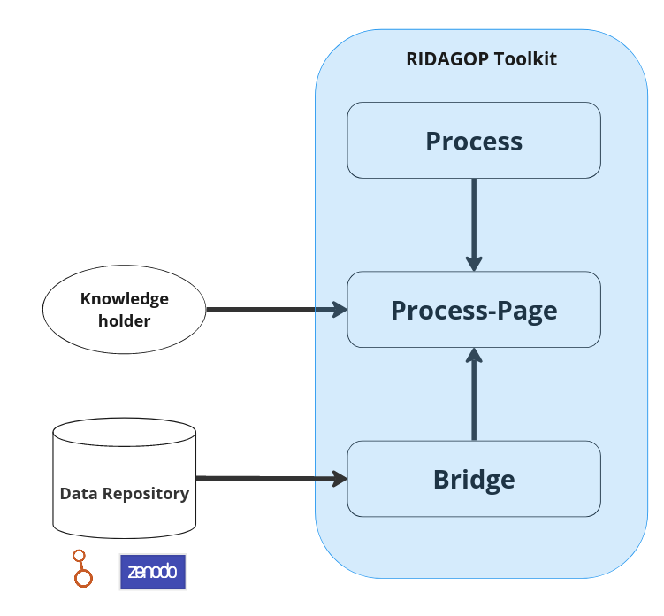

# RIDAGOP IDS toolkit

What is the IDS toolkit? 
  
Indigenous data sovereignty involves ensuring that Indigenous people have ownership and control over the collection, use, and management of their own data. Centralized data repositories can make it difficult for Indigenous communities to access and control their own data. They may be subject to restrictive policies and procedures that limit who can access the data, how it can be used, and where it can be stored. This can undermine Indigenous self-determination and limit the ability of Indigenous communities to use their own data to inform decision-making, planning, and development. 

 
The Research on Indigenous Data Governance Protocols (RIDAGOP) toolkit tries to tackle some of these problems, by allowing developers to create data-management processes that can interact with data repositories and can be used with custom built websites, tailored to the requirements of individuals communities, peoples, institutions or requests.  

The toolkit's data management processes can include: 

- Storing data in ways that are secure, reliable, and accessible to Indigenous communities, peoples, organisations or institutions.  

- Sharing data with other Indigenous communities and organizations, as well as with non-Indigenous entities, in ways that are respectful and protect Indigenous rights. 

- Updating and maintaining metadata, which helps to contextualize and safeguard Indigenous data. 

 

The RIDAGOP toolkit allows developers to create data management processes, generate (or embed them into) web-based user interfaces and make them usable by communities. 

The toolkit is designed in such a way that it can be connected to any type of repository system, given this repository offers an API 1. It is also not necessary that the toolkit is “installed” or served from on the repository server, or any specific website. It can be hosted on any website and still interact with the defined repositories. 

The toolkit can be distinguished into 3 main parts. Specifically, it can be separated into 3 different types of files that interplay within the toolkit. 

The following diagram shows a general overview of how the different components of the toolkit interact with each other. 

<figure markdown>
  { width="400"}
</figure>

### Processes
Process files are abstract descriptions of what a process is supposed to do and what the individual components (e.g., data-repositories, metadata catalogues, ...) are required to be capable of, in order to function within this process. It does not specify which repository or datasets should be used.

> An example of a process would be allowing communities to add their own meta-data to dataset. The Local Contexts Project developed TK and BC Labels (traditional knowledge and Biocultural) through sustained partnership within Indigenous communities. “The Labels allow communities to express local and specific conditions for sharing and engaging in future research and relationships in ways that are consistent with already existing community rules, governance and protocols for using, sharing and circulating knowledge and data.” 
One process would be to allow communities to add their own Labels to any dataset they wish to. 

> A second more intrinsic process would be restricting data access by default and having a convenient but complete data application process in place. No one would not directly have access to the data but would need to fill out a data access application form, which would be reviewed by somehow having some authority to grant access (CLARIFY AUTHORITY?). This process could be implemented in many ways, adjusting, how the application form would look like, how the evaluation is conducted. In addition, it could be that the data authorities only provide a subset of the data, or even only execute the analysis themselves and only provide the results, keeping the data for themselves, though whole time.  

### Bridges

Bridges: Researchers that want to publish their data can often choose between many different repository systems or might be mandated to publish on specific repository. There are repositories by individual universities or by consortiums of universities. There are also international data repositories like Zenodo or the European data portal. While the general functionalities of these repositories might be similar, some provide specific functions. Bridges are files that describe the capabilities of specific data-repositories and how they are used, so that these repositories can work with toolkit processes. It specifies, how the API of the repository looks like and how they map to capabilities. 

> For example in order to make Zenodo work someone would need to write a specification file that would include a) the JavaScript code, that can interact with the repository and b) some mapping between the functions of that code and generic capabilities like creating a new dataset, changing metadata or adding or removing dataset files.  

### Process pages

Process-pages description files that bring specific processes and bridges together in order to complete a process on a specific data-repository. A process-page file can generate a whole website that allows the completion of a process, which allows individuals to interact with the repositories. However, it is also possible to design a custom website and connect relevant interactive elements (input fields, buttons, etc.) to the toolkit functionalities. 

> Both individual processes mentioned above could be used in their individual process-pages (a single webpage). When a community knows on which repository system their data is hosted the process page, could bring for that repository the bridge and their processes together allowing them to manage their data, without spending too much time on the repository system. This process pages, could be designed in such a way that it meets their needs in terms of accessibility and usability. 

## How does the toolkit work with different data-repositories

When a process describes the functioning of a service, it does not need to describe
the exact endpoints of a particular service. 
The **process-page** assigns **bridge** which define, which particular service to use and how to communicate it.
Generally speaking there are two ways of doing that. Either through a *bridge-module*, which is a simply a javascript module, 
that exports functions which communicate with the repository/service or with an OpenAPI json file, which
contains all endpoints of the service.

# What is required to create a Process for a specific Data repository

