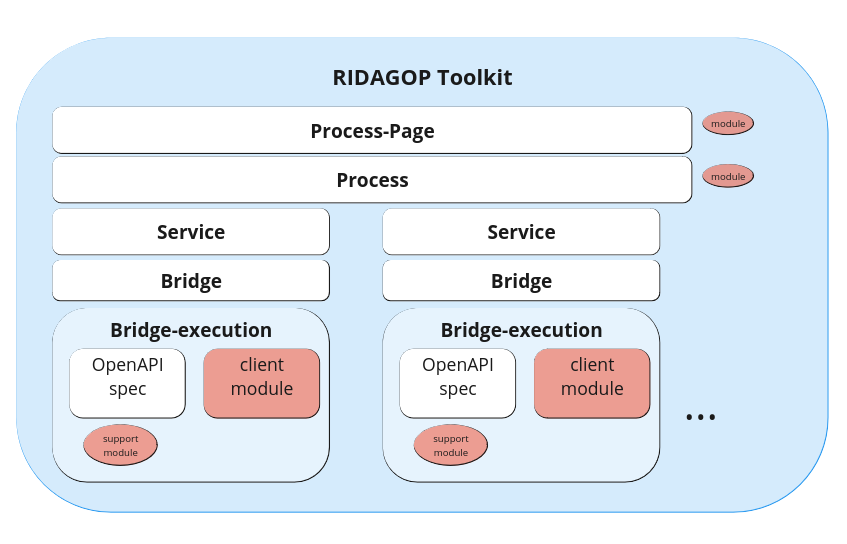

# Technical overview

The IDS toolkit is a simple javascript module that can be integrated into any website.
When the module is loaded on a webpage, a process-page can be initiated by calling the global `_ids_init_` function,
with the url of the process-page description file as argument.

The Process-Page is a json file that describes the process-page. It links (or includes) the process, which describe the
services of a process, which contain activities.

The essential parts that define what a process can do, and how a user can interact with it, are the activities and the
ui-elements of services.

The toolkit provides a set of json-schema files, that can be used to validate the process-page, process, bridge. There
is also a json-schema file that integrates all of them and provides validation for an integrated proces-page description
file.
The json-schemas are described here in more detail in [the Schemas section](/Schemas).

<figure markdown>
  { width="700"}
</figure>

Following components of a complete process can be separated into different files json:

- Process-Page
- Process
- Bridge
- Bridge-execution (one of the following)
  - OpenAPI-specification
  - client-module (javascript module)

However, it also possible to combine all components into one file (except the client-module).

In addition, there can be separate javascript modules, that be referenced by specific components:

- Process-Page module
- Process module
- Bridge module

These modules can be used to define custom functions, that can be used for activities which modify some data before or after interacting with a service.
When a function is defined in multiple modules, the one of the most upper one module is used.

Further detail about the components can be found in their respective API documentation.

### View modes

Process pages can be displayed in two different view modes. 
Either the page can be completely generated, meaning all input html elements will be generated (build-mode) 
in map-mode, where the defined interaction elements will be mapped to existing html on the page. 
Read more about the 2 view modes in the [View Modes section](/view_modes.md).

## Process

A process defines a set of __services__, which describe how the user can interact with external services.

A service, which has a bridge defines a set of activities and ui-elements that can be used to interact with the service.
Next to the services the process can also define a `common` object, activities and ui-elements.
This is particular useful, when activities, need to call activities from other services (in subActivities).

TODO...

### Services

TODO...

#### UI-Elements

The UI-Elements are defined per service. There are five types of UI-Elements that can be defined:

- Input fields: 
- Buttons:
- Selects:
- Checkboxes:
- File-inputs: 

TODO...

### Activities

TODO: create diagram.
activity:

- moduleFunction: 
- bridgeCapability -> Bridge (bridgeCapability) -> Execution

preProcess: ... (cancel)
output: ...
store: ...

#### Activity parameter

TODO...

### Bridge

TODO...

